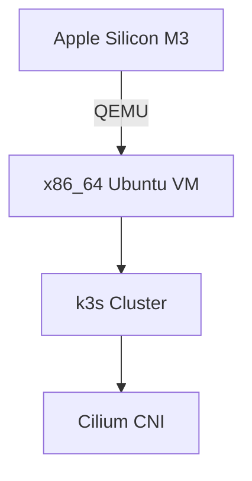

# k3s with Cilium CNI on Ubuntu 24.04 (QEMU Image)

**Prebuilt x86_64 Kubernetes image compiled on M3 Mac (Apple Silicon)**  
ARM-to-x86 cross-architecture emulation fully supported via QEMU

## Key Features

- Ready-to-run k3s cluster with cilium-cli 1.16.6
- Optimized for QEMU/KVM virtualization
- x86 compatibility layer for ARM-based development machines
- Automated security hardening:
  - SSH root access disabled
- KubeVirt-ready for VM management in Kubernetes clusters (https://kubevirt.io)

## Cross-Architecture Support



## Requirements

| Component | Minimum Version |
|-----------|-----------------|
| Packer    | 1.9.x           |
| QEMU      | 8.1.x           | 
| macOS     | Sonoma 14.4+    |

## Prerequisites

```bash
# Install required tools via Homebrew
brew install packer qemu make
```

## Quick Start

```bash
# Build image (takes ~7-10 mins on M3)
make build

# Automated CI test (background process)
make check-auto
```

## File Structure

```
.
├── cloud-init/               # Cloud-init configs
├── output/                   # Packer artifacts
├── scripts/                  # Provisioning scripts
├── templates/                # Config templates
├── Makefile                  # Build automation
└── ubuntu-24-cilium.pkr.hcl  # Packer template
```

## Contact

- Telegram Channel with IT Notes: [t.me/azalio_tech](http://t.me/azalio_tech)  
- LinkedIn Profile: [linkedin.com/in/azalio](https://www.linkedin.com/in/azalio/)  
- GitHub Repository: [https://github.com/azalio/cloud-images](https://github.com/azalio/cloud-images)

