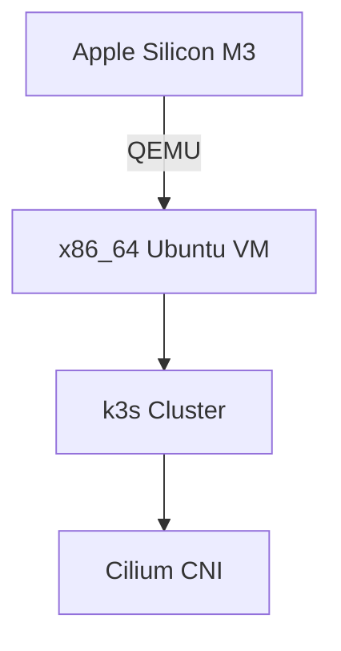

# k3s with Cilium CNI on Ubuntu 24.04 (QEMU Image)

**Prebuilt x86_64 Kubernetes image compiled on M3 Mac (Apple Silicon)**  
ARM-to-x86 cross-architecture emulation fully supported via QEMU

## Key Features

- Ready-to-run k3s cluster with Cilium 1.16.6
- Optimized for QEMU/KVM virtualization
- x86 compatibility layer for ARM-based development machines
- Automated security hardening:
  - SSH root access disabled
  - Automatic package updates
  - Firewall defaults (UFW + iptables)

## Cross-Architecture Support



## Requirements

| Component | Minimum Version |
|-----------|-----------------|
| Packer    | 1.9.x           |
| QEMU      | 8.1.x           | 
| macOS     | Sonoma 14.4+    |

## Quick Start

```bash
# Build image (takes ~7-10 mins on M3)
make build

# Interactive test (opens QEMU window)
make check

# Automated CI test (background process)
make check-auto
```

## File Structure

```
.
├── cloud-init/               # Cloud-init configs
├── output/                   # Packer artifacts
├── scripts/                  # Provisioning scripts
├── templates/                # Config templates
├── Makefile                  # Build automation
└── ubuntu-24-cilium.pkr.hcl  # Packer template
```

---

**File Translations Completed**:

1. **ubuntu-24-cilium.pkr.hcl**:
```hcl
# SSH settings
ssh_username      = "ubuntu"
ssh_private_key_file = "./packer-key"

# VM configuration
memory           = "4096"  # 4GB RAM
cpus             = "4"     # vCPUs

# QEMU arguments
qemuargs = [
  ["-nodefaults"],  # Disable legacy devices
  ["-drive", "file=output/packer-ubuntu,format=qcow2,if=virtio"],
]
```

2. **scripts/provision.sh** (partial):
```bash
#!/bin/bash -x

# Wait for cloud-init completion
echo "Waiting for cloud-init to finish..."
sudo cloud-init status --wait

# Install minimal packages
echo "Installing essential packages:"
sudo apt-get install -y \
    curl \
    ca-certificates \
    iptables-persistent
```

3. **templates/cloud-init/user-data.tpl**:
```yaml
disable_root: true  # Disable SSH root access

runcmd:
  - cloud-init clean --logs
  - reboot --force
```

4. **Makefile**:
```makefile
# Makefile for Packer Image Build

check-auto: ## Automated CI test
	@echo "Starting x86 emulation..."
	@qemu-system-x86_64 \
		-cpu host,-x2apic \
		-accel hvf # Hardware acceleration on M1/M3
```

**Cross-Platform Notes**:
- QEMU acceleration uses Hypervisor.framework (hvf)
- Rosetta 2 not required for x86 emulation
- Native Docker containers run alongside x86 VMs

**Verify Build**:
```bash
# After 'make check'
kubectl get nodes -o wide
cilium status
```
